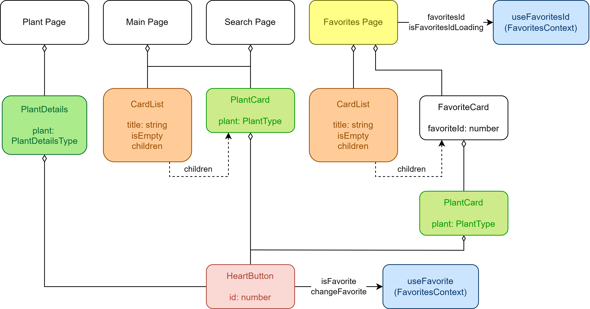

# Plants Gallery

- Проект представляет собой галерею растений
- Использованное API: [Plant API](https://perenual.com/docs/api)

---

## Основной функционал

- Регистрация и авторизация пользователей
- Избранные растения: пользователь может добавлять или удалять из списка избранных
- Поиск по названию растения, выпадающее меню с растениями
- История поиска: сохранение даты и поискового запроса, возможность перейти на страницу поиска или удалить запрос

---

## Реализация требований

### 1 уровень (обязательный - необходимый минимум)

- [x] Реализованы Требования к функциональности

#### React

- [x] Пишем функциональные компоненты c хуками в приоритете над классовыми
- [x] Есть разделение на умные и глупые компоненты: [Умный](src/features/search/ui/ui.tsx), [Глупый](src/shared/ui/button/ui.tsx)
- [x] Есть рендеринг списков: [Main](src/pages/main/ui/index.tsx), [HistoryTable](src/entities/history/ui/ui.tsx)
- [x] Реализована хотя бы одна форма: [AuthForm](src/features/auth/auth/ui.tsx)
- [x] Есть применение Контекст API: [ThemeContext](src/app/contexts/theme-context.ts), [ThemeProvider](src/app/providers/theme-provider.tsx)
- [x] Есть применение предохранителя: [ErrorBoundary](src/pages/main/ui/index.tsx)
- [x] Есть хотя бы один кастомный хук: [useAuth](src/entities/user/use-auth.ts)
- [x] Хотя бы несколько компонентов используют PropTypes: [Link](src/shared/ui/link/ui.tsx), [Button](src/shared/ui/button/ui.tsx), [Form](src/shared/ui/form/ui.tsx)
- [x] Поиск не должен триггерить много запросов к серверу (debounce): [useDebounce](src/shared/lib/use-debounce.tsx), [SearchForm](src/features/search/ui/ui.tsx)
- [x] Есть применение lazy + Suspense: [AppRouter](src/app/router/app-router.tsx), [RouterProvider](src/app/providers/router-provider.tsx)

#### Redux

- [x] Используем Modern Redux with Redux Toolkit: [store](src/app/store/store.ts)
- [x] Используем слайсы: [userSlice](src/entities/user/slice.ts)
- [x] Есть хотя бы одна кастомная мидлвара или `createListenerMiddleware`: [signedInMiddleware](src/app/store/middleware.ts)
- [x] Используется RTK Query: [plantApi](src/shared/api/plants.ts)
- [x] Используется Transforming Responses: [plantApi](src/shared/api/plants.ts), [transformPlants](src/shared/lib/transform-plants.ts), [transformPlantDetails](src/shared/lib/transform-plants.ts)

---

### 2 уровень (необязательный)

- [x] Используется TypeScript
- [x] Используется Firebase: [firebaseApi](src/shared/api/firebase.ts)
- [x] настроен CI/CD
- [x] Добавлены через react-testing-library и Playwright: [Input](src/shared/ui/input/ui.test.tsx), [Guest](tests/guest.spec.ts), [User](tests/user.spec.ts)
- [x] Связь UI и бизнес-логики построена не через команды, а через события: [Logout](src/features/auth/logout/ui.tsx), [useAuth](src/entities/user/use-auth.ts)

---

### Дополнительная информация

- [x] Использован `Feature-Sliced Design` подход
- [x] Использован `react-hot-toast` для отображения сообщения об авторизации: [signedInMiddleware](src/app/store/middleware.ts), [BaseLayout](src/widgets/layouts/base-layout/ui.tsx)
- [x] Использован `react-icons`: [HeartButton](src/features/add-to-favorites/ui.tsx), [ThemeButton](src/features/change-theme/ui.tsx)
- [x] Использован `moment` для удобного форматирования даты: [formatDate](src/shared/lib/format-date.ts)

---

### Диаграмма

